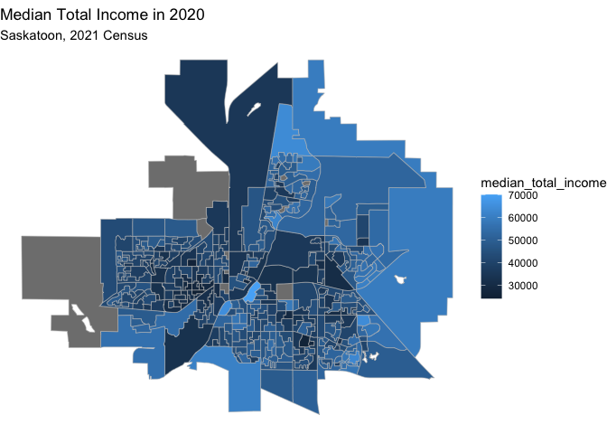
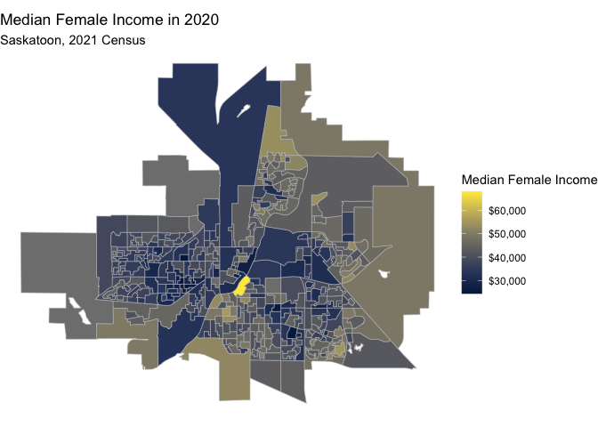
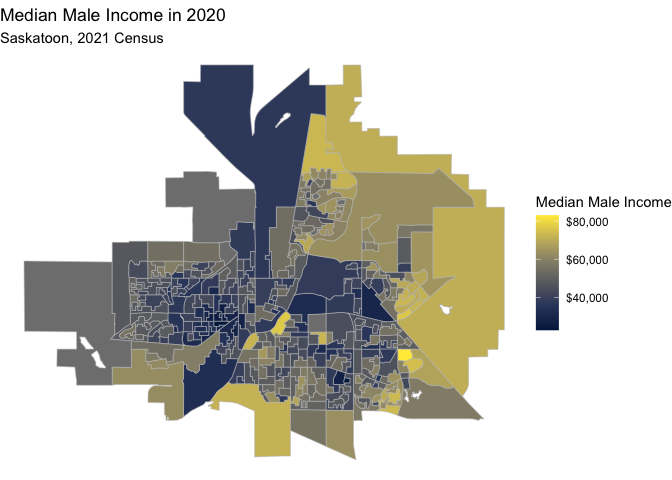

```r
census_data <- get_census(dataset='CA21', regions=list(CSD="4711066"), 
                          vectors=c("median_total_income"="v_CA21_560","median_female_income"="v_CA21_562", "median_male_income"="v_CA21_561"),
                          labels="detailed", geo_format="sf", level='DA')
```

```
## Census data is currently stored temporarily.
## 
##  In order to speed up performance, reduce API quota usage, and reduce unnecessary network calls, please set up a persistent cache directory via `set_cancensus_cache_path('<local cache path>', install = TRUE)`.
##  This will add your cache directory as environment varianble to your .Renviron to be used across sessions and projects.
## 
## 
## Census data is currently stored temporarily.
## 
##  In order to speed up performance, reduce API quota usage, and reduce unnecessary network calls, please set up a persistent cache directory via `set_cancensus_cache_path('<local cache path>', install = TRUE)`.
##  This will add your cache directory as environment varianble to your .Renviron to be used across sessions and projects.
```

```
## Querying CensusMapper API...
```

```
## 
Downloading: 7.4 kB     
Downloading: 7.4 kB     
Downloading: 7.4 kB     
Downloading: 7.4 kB
```

```
## Census data is currently stored temporarily.
## 
##  In order to speed up performance, reduce API quota usage, and reduce unnecessary network calls, please set up a persistent cache directory via `set_cancensus_cache_path('<local cache path>', install = TRUE)`.
##  This will add your cache directory as environment varianble to your .Renviron to be used across sessions and projects.
## 
## 
## Querying CensusMapper API...
```

```
## 
Downloading: 3.6 kB     
Downloading: 3.6 kB     
Downloading: 3.6 kB     
Downloading: 3.6 kB     
Downloading: 3.6 kB     
Downloading: 3.6 kB     
Downloading: 3.6 kB     
Downloading: 3.6 kB     
Downloading: 3.6 kB     
Downloading: 3.6 kB     
Downloading: 7.6 kB     
Downloading: 7.6 kB     
Downloading: 12 kB     
Downloading: 12 kB     
Downloading: 16 kB     
Downloading: 16 kB     
Downloading: 20 kB     
Downloading: 20 kB     
Downloading: 28 kB     
Downloading: 28 kB     
Downloading: 28 kB     
Downloading: 28 kB     
Downloading: 28 kB     
Downloading: 28 kB     
Downloading: 28 kB     
Downloading: 28 kB     
Downloading: 28 kB     
Downloading: 28 kB     
Downloading: 28 kB     
Downloading: 28 kB     
Downloading: 32 kB     
Downloading: 32 kB     
Downloading: 40 kB     
Downloading: 40 kB     
Downloading: 40 kB     
Downloading: 40 kB     
Downloading: 44 kB     
Downloading: 44 kB     
Downloading: 52 kB     
Downloading: 52 kB     
Downloading: 56 kB     
Downloading: 56 kB     
Downloading: 68 kB     
Downloading: 68 kB     
Downloading: 76 kB     
Downloading: 76 kB     
Downloading: 85 kB     
Downloading: 85 kB     
Downloading: 93 kB     
Downloading: 93 kB     
Downloading: 100 kB     
Downloading: 100 kB     
Downloading: 110 kB     
Downloading: 110 kB     
Downloading: 120 kB     
Downloading: 120 kB     
Downloading: 120 kB     
Downloading: 120 kB     
Downloading: 130 kB     
Downloading: 130 kB     
Downloading: 130 kB     
Downloading: 130 kB     
Downloading: 130 kB     
Downloading: 130 kB     
Downloading: 150 kB     
Downloading: 150 kB     
Downloading: 150 kB     
Downloading: 150 kB
```

```r
str(census_data)
```

```
## Classes 'sf' and 'data.frame':	371 obs. of  18 variables:
##  $ Shape Area          : num  2.8764 0.102 0.1532 0.0551 0.1451 ...
##  $ Type                : Factor w/ 1 level "DA": 1 1 1 1 1 1 1 1 1 1 ...
##  $ Households          : int  256 122 184 116 132 219 242 91 203 151 ...
##  $ Quality Flags       : chr  "0" "0" "0" "0" ...
##  $ name                : chr  "47110021" "47110022" "47110027" "47110028" ...
##  $ GeoUID              : chr  "47110021" "47110022" "47110027" "47110028" ...
##  $ CSD_UID             : chr  "4711066" "4711066" "4711066" "4711066" ...
##  $ Population          : int  720 344 519 397 364 595 492 236 437 418 ...
##  $ CT_UID              : chr  "7250021.05" "7250021.05" "7250021.05" "7250021.05" ...
##  $ Dwellings           : int  260 127 188 120 135 229 252 93 212 154 ...
##  $ CD_UID              : chr  "4711" "4711" "4711" "4711" ...
##  $ CMA_UID             : chr  "47725" "47725" "47725" "47725" ...
##  $ Region Name         : Factor w/ 371 levels "47110021","47110022",..: 1 2 3 4 5 6 7 8 9 10 ...
##  $ Area (sq km)        : num  2.8764 0.102 0.1532 0.0551 0.1451 ...
##  $ median_total_income : num  64000 57600 55600 39200 51600 49200 40000 NA 35600 53200 ...
##  $ median_female_income: num  53600 53200 47200 38400 46800 45200 34800 NA 35200 44400 ...
##  $ median_male_income  : num  73000 58800 68000 41200 57600 54400 46800 NA 36400 65000 ...
##  $ geometry            :sfc_MULTIPOLYGON of length 371; first list element: List of 1
##   ..$ :List of 1
##   .. ..$ : num [1:86, 1:2] -107 -107 -107 -107 -107 ...
##   ..- attr(*, "class")= chr [1:3] "XY" "MULTIPOLYGON" "sfg"
##  - attr(*, "sf_column")= chr "geometry"
##  - attr(*, "agr")= Factor w/ 3 levels "constant","aggregate",..: 1 1 1 1 1 1 1 1 1 1 ...
##   ..- attr(*, "names")= chr [1:17] "Shape Area" "Type" "Households" "Quality Flags" ...
```


```r
ggplot(census_data) + geom_sf(aes(fill = median_total_income), colour = "grey") +
  scale_colour_brewer("Median Total Income", labels = scales::dollar) + theme_void() +
  theme(panel.grid = element_blank(),
        axis.text = element_blank(),
        axis.ticks = element_blank()) + 
  coord_sf(datum=NA) +
  labs(title = "Median Total Income in 2020", subtitle = "Saskatoon, 2021 Census")
```

<!-- -->


```r
ggplot(census_data) + geom_sf(aes(fill = median_female_income), colour = "grey") +
  scale_fill_viridis_c("Median Female Income", labels = scales::dollar, option = "cividis") + theme_void() +
  theme(panel.grid = element_blank(),
        axis.text = element_blank(),
        axis.ticks = element_blank()) + 
  coord_sf(datum=NA) +
  labs(title = "Median Female Income in 2020", subtitle = "Saskatoon, 2021 Census")
```

<!-- -->


```r
ggplot(census_data) + geom_sf(aes(fill = median_male_income), colour = "grey") +
  scale_fill_viridis_c("Median Male Income", labels = scales::dollar, option = "cividis") + theme_void() +
  theme(panel.grid = element_blank(),
        axis.text = element_blank(),
        axis.ticks = element_blank()) + 
  coord_sf(datum=NA) +
  labs(title = "Median Male Income in 2020", subtitle = "Saskatoon, 2021 Census")
```

<!-- -->

